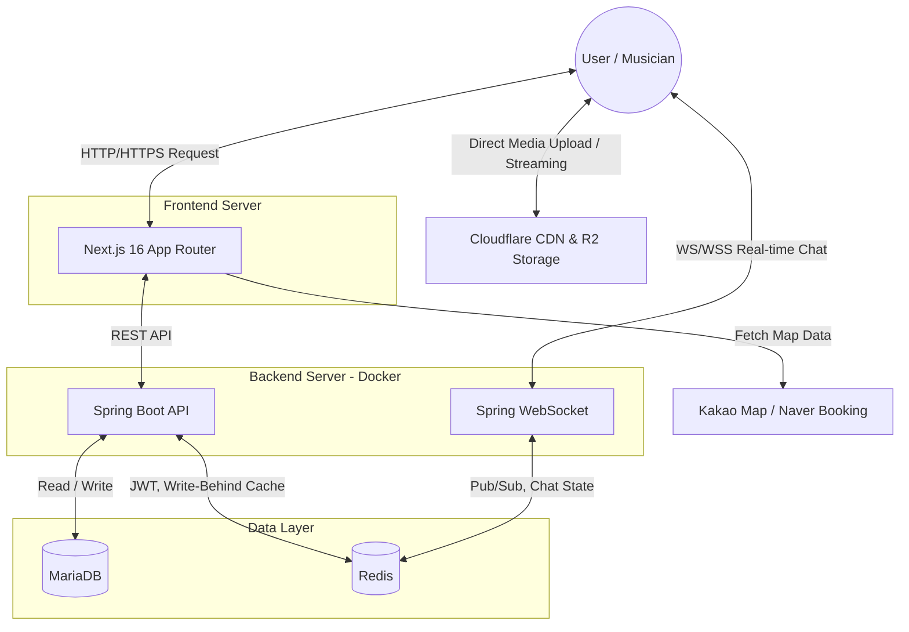

# 🎸 OurBand (아워밴드)

> **음악으로 하나 되는 우리만의 공간, 뮤지션 네트워크 플랫폼 'OurBand'**
> 
> "주변에 같이 음악 할 사람 어디 없나?" "급하게 대타 세션이 필요한데 어떡하지?"
> OurBand는 밴드 음악을 사랑하는 모든 뮤지션들을 위해 합주실 탐색, 실시간 잼(Jam) 영상 공유, 1:1 대화, 대타 구인 등을 지원하는 **종합 뮤지션 네트워크 플랫폼**입니다.

 

## 🎯 프로젝트 개요

- **프로젝트명**: OurBand (아워밴드)
- **개발 인원**: 1인 개발 (풀스택)
- **기획 기간**: 2026.01 ~ 2026 ~ 04
- **개발 기간**: 2026.05 ~ 진행 중

 

## 🛠 Tech Stack

### Frontend
- **Framework**: Next.js (App Router), React
- **Language**: TypeScript
- **Styling**: Tailwind CSS
- **Animation & Icons**: framer-motion, lucide-react
- **State Management & Fetching**: React Context, Axios

### Backend
- **Framework**: Spring Boot
- **Language**: Java 21
- **Database**: MariaDB, Redis
- **ORM**: Spring Data JPA
- **Authentication**: JWT (JSON Web Token)
- **Real-time Communication**: Spring WebSocket

### Infrastructure & CI/CD
- **Server**: Linux (Ubuntu)
- **Container**: Docker, Docker Compose
- **Process Manager**: PM2 (Frontend)
- **CI/CD**: GitHub Actions (appleboy/ssh-action)

 

## 🌟 핵심 기능 (Key Features)

### 1. 실시간 오디오 잼 (Audio Jam) 🎧
- 자신의 연주나 노래 영상을 업로드하고 피드를 통해 공유
- 스크롤을 통한 실시간 영상 피드 기능 제공 (트렌딩, 최신순)
- 커스텀 비디오 플레이어 UI 및 매끄러운 오디오 컨트롤 구현

### 2. 주변 합주실 탐색 & 예약 🥁
- 내 위치 기반 주변 합주실 탐색 (Haversine formula 활용)
- 합주실 장비 현황, 방 크기, 리뷰 및 별점 제공
- 합주실 등록자와의 실시간 **1:1 대화하기** 기능 제공
- 카카오/네이버 맵 외부 데이터 연동 및 외부 예약 링크 제공

### 3. 뮤지션 매칭 & 1:1 실시간 채팅 💬
- 지역 및 포지션 기반 프로필 필터링
- WebSocket을 활용한 실시간 1:1 채팅방 생성 및 대화 기능
- "긴급 대타 구인" 시스템을 통한 실시간 푸시/알림 전송

### 4. 관리자 대시보드 (Admin Dashboard) 🛡️
- 신고된 사용자, 합주실, 게시물 등을 관리하는 모니터링 시스템
- **시스템 관리자** 및 **서비스 관리자** 권한 분리
- *포트폴리오 심사위원을 위한 테스트 계정 원클릭 로그인 제공*

 

## 🏗 System Architecture

 

## 🚀 CI/CD Pipeline

본 프로젝트는 **GitHub Actions**를 활용하여 자동화된 무중단(에 가까운) 배포 환경을 구축했습니다.
1. `main` 브랜치에 코드가 푸시되면 GitHub Actions 트리거
2. SSH 접속을 통해 운영 서버에 접근
3. 최신 코드 Pull (Git)
4. **Backend**: `docker-compose up -d --build` 를 통한 컨테이너 재빌드 및 재시작
5. **Frontend**: 패키지 설치(`npm install`) 및 Next.js 빌드(`npm run build`), 이후 PM2를 통한 프로세스 재시작(`pm2 restart all`)

 

## 💡 기술적 고민과 문제 해결 (Trouble Shooting)

### 1. 대규모 트래픽 대비 좋아요/조회수 처리 병목 현상 개선 (Write-Behind Caching)
- **문제**: 뮤지션 커뮤니티와 잼 피드 특성상 '좋아요'와 '조회수' 증가 요청이 매우 빈번하게 발생합니다. 매 요청마다 데이터베이스(MariaDB)에 직접 UPDATE 쿼리를 날릴 경우, 레코드 락(Lock) 경합과 디스크 I/O 부하가 발생하여 전체 API 성능이 저하되는 병목 현상이 있었습니다.
- **해결**: **Redis를 활용한 Write-Behind(Write-Back) 캐싱 전략**을 도입했습니다. 사용자의 좋아요/조회수 액션은 즉시 속도가 빠른 Redis(Hash/Set 구조)에만 기록하여 응답 속도를 높이고, Spring `@Scheduled` 기반의 동기화 스케줄러(`LikeViewSyncScheduler`)가 1분 주기로 변경된 데이터만 큐에서 꺼내어 RDBMS에 일괄 업데이트(Bulk Update)하도록 설계하여 데이터베이스 부하를 획기적으로 줄였습니다.

### 2. 내 위치 기반 주변 합주실 탐색 쿼리 성능 최적화 (Bounding Box)
- **문제**: 사용자의 현재 위치를 기준으로 반경 N km 이내의 합주실을 검색할 때, 단순히 DB의 모든 합주실을 대상으로 Haversine 거리 계산을 수행하면 풀 테이블 스캔(Full Table Scan) 연산이 발생하여 데이터가 많아질수록 응답 속도가 현저히 느려졌습니다.
- **해결**: 데이터베이스 연산을 최소화하기 위해 **Bounding Box(경계 상자) 알고리즘**을 선적용했습니다. 위도 1도(약 111km) 상수를 활용해 검색 반경의 최대/최소 위경도를 구한 뒤, DB 인덱스를 활용하는 범위 검색(`findByLatBetweenAndLngBetween`)으로 1차 데이터 후보군을 대폭 줄였습니다. 이후 필터링된 소수의 데이터에 대해서만 Application 단에서 정확한 Haversine 거리를 계산하도록 리팩토링하여 검색 속도를 극대화했습니다.

### 3. 비디오 플레이어 오디오 음소거(Mute) 상태 동기화
- **문제**: React 상태(`isMuted`)만으로 비디오 태그의 `muted` 속성을 제어했을 때, 일부 브라우저 환경에서 실제 볼륨이 음소거되지 않는 문제 발생.
- **해결**: 음소거 토글 시 React 상태뿐만 아니라 `videoRef.current.volume = 0` 및 `videoRef.current.muted = true`를 강제하여 미디어 볼륨 값을 동적으로 직접 덮어씌움으로써 문제를 완벽히 해결.

### 4. JWT 토큰 탈취 방지 및 안전한 로그아웃 제어 (Redis)
- **문제**: 상태를 유지하지 않는(Stateless) JWT 특성상 Access Token이 탈취되면 만료되기 전까지 악용될 수 있으며, 서버 측에서 특정 사용자를 즉시 로그아웃(토큰 무효화)시키기 까다로운 보안적 한계가 있었습니다.
- **해결**: 인메모리 데이터 저장소인 **Redis를 활용하여 JWT 생명주기를 엄격하게 통제**했습니다. Access Token의 유효 기간은 짧게 설정하고, 긴 수명의 Refresh Token은 Redis에 저장(TTL 지정)하여 토큰 재발급을 제어했습니다. 로그아웃 시 Redis에서 Refresh Token을 삭제하고, 아직 만료되지 않은 Access Token은 남은 수명만큼 Redis의 Blacklist(블랙리스트)에 등록하여 스프링 시큐리티 필터 단에서 접근을 원천 차단하도록 보안을 대폭 강화했습니다.
- 
### 5. 대용량 동영상/이미지 트래픽 분산 및 로딩 속도 개선 (Cloudflare R2 & CDN)
- **문제**: '실시간 오디오 잼(Jam)'과 합주실 리뷰 특성상 다량의 연주 동영상과 고화질 이미지가 지속적으로 업로드/조회됩니다. 메인 서버에서 미디어 파일의 입출력과 스트리밍을 모두 처리하자, 대역폭(Bandwidth) 초과 및 서버 디스크 I/O 병목이 발생하여 영상 버퍼링과 피드 로딩 속도 저하가 심각했습니다.
- **해결**: 글로벌 엣지 네트워크를 갖춘 **Cloudflare R2 (Object Storage)와 CDN**을 도입했습니다. 클라이언트가 파일을 서버를 거치지 않고 Cloudflare 스토리지로 직접 업로드하도록 처리하여 메인 WAS 서버의 부하를 덜어냈습니다. 동시에 Cloudflare의 강력한 CDN 캐싱을 통해 수많은 사용자에게 지연(Latency) 없이 고용량 동영상과 이미지를 초고속으로 전송(Streaming)하도록 아키텍처를 개선했습니다.
 

## 👨‍💻 심사위원 / 리뷰어 안내 사항

로그인 화면( `/login` ) 하단에 **[포트폴리오 심사위원용 테스트 계정]** UI가 마련되어 있습니다. 
해당 블록을 클릭하시면 별도의 회원가입 없이 자동으로 관리자 계정(시스템 관리자 / 서비스 관리자) 정보가 기입되어 빠르게 기능을 테스트해보실 수 있습니다.

---
*Thank you for reading!*
